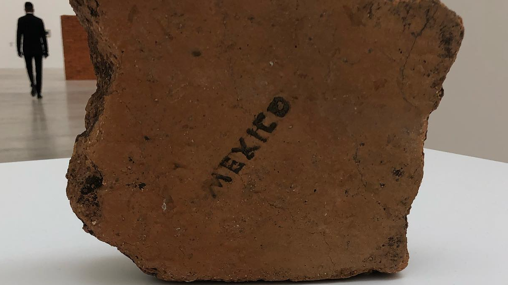

# Alejandra

Un mes antes de regresar a México inicié un experimento social. La premisa era que volver a México suponía volver a ver gente que ya conozco, que ya sé como piensa, que ya sé que opinan y que ya sé como reaccionan. No quería entrar en un juego de *confirmation bias* porque de otra manera solo iba a alimentar las preconcepciones que tenía hacia mi pais, tanto las positivas como las negativas.

La visita requería conocer gente nueva, gente que me contara su punto de vista, sus experiencias, lo que tenían que decir de su gente, de su ciudad, de mi ciudad.

Un dilema asociado a mi experimento social es que no conocía a nadie fuera de mi circulo social y tampoco podía llegar del aeropuerto saludando a extraños a diestra y siniestra. Qué clase de psicópata hace eso en pleno 2022? Ese mismo dilema aplica a un abordaje digital, mandar solicitudes de amistad en Facebook, Twitter no era una opción. Quién en su sano juicio esta dispuesto a exhibirse en redes sociales con la intención de entablar conversación con perfectos extraños? La respuesta: gente que usa aplicaciones de citas.

Genuinamente creo que muchos de los problemas en México tienen un origen en las dinámicas de poder que vienen impuestas con nuestra cultura. Sea que vengan de religión, "valores" familiares, tradiciones, etc. Muchas de esas dinámicas de poder se pueden resumir como machismo, aunque siento que estoy mencionando lo obvio.

Culturalmente e incluso biológicamente, los que portamos cromosomas XY traemos precargada una actitud de hipercompetitividad y de rivalidad implicita, la cual no me es ajena pero no por ello me es menos incómoda. 

Admitidamente no disfruto mucho la compañía masculina, muchísimo menos al estar consciente de que muchos problemas en México son causados, propiciados y, tolerados por banda con cromosomas XY.

Volviendo al experimento social, pensé que un abordaje interesante sería usar tinder para ver a México a través de los ojos de morras que estaban abiertas a la conversación, una conversación respetuosa si bien informativa y desde luego amena. En mi perfil fui muy claro, sólo iba a estar en México hasta el 28 de octubre, no buscaba una relación ni un acostón, sólo quería hacer las pases con el pais.

Kristal fue la primera en responder, pero claramente no leyó mi perfil, en algún momento me dijo "Eres muy bueno ligando"... y yo... okay, next.

Alejandra fue la siguiente en responder, le entró al proyecto y de ella se tratan estas líneas.

Ale es una química que trabaja en logística, una morra ciclista, guapa, divorciada y con excelente plática. Fue la persona que me dio santo y seña de como y por qué el pais estaba simultaneamente bien y mal. Su grupo @morras_cycling_club promueve el ciclismo para mujeres como un espacio seguro de integración y por qué no?, para hacer ciclismo. Ale se ganó el premio a "La morra más inspiradora" y con muchísima razón, su kilometraje, su integridad, su persona son dignos de admirarse, y su muchas morras voltean a verla, creo fielmente que podrían preguntarse: "Y si le entrará al ciclismo?"

Ale me contó muchas historias de la gran ciudad, y me dio la vuelta por la colonia Roma y la colonia Condesa, cuna del privilegio invisible en la CDMX. Sin duda un lugar deseable para vivir, pero no tan diverso para reflejar lo que pasa en el resto de la ciudad, muchisimo menos para reflejar lo que ocurre en el resto del pais.

Fuimos a comer a un restaurante moderadamente fifi en donde una persona en condiciones precarias se acercó a pedirnos una limosna. Optamos por comprarle una hamburguesa y al parecer le hicimos el día. Ale me comentaba que el riesgo de comer fuera es que constantemente podrías ser interrumpido por morrxs que venden dulces, gente pidiendo limosna y el ocasional artista callejero.

Lo anterior hace que la gente sea reaccionaría, comer dentró de los restaurantes para cerrar los ojos ante los problemas de la ciudad. Nuevamente entraba en juego nuestra frase de "los buenos somos más", y si bien comer dentro de un restaurant para evitar ser interrumpidos por la gente con menos privilegio no era una mala acción, definitivamente no era una buena acción.

Ale nunca tuvo empacho en darle su hamburguesa a la señora, ni tampoco en darle cincuenta pesitos al guitarrista que amenizó nuestra pizza y chelas. "Ale es de la buenas", pensaba, y su labor altruista respaldaba mi apreciación.

Las dinámicas de clases sociales han tenido corrimientos importantes, aunque marginales en el gran esquema de las cosas. En los 80, la población de la CDMX era mucho menor, y si bien los crimenes y las condiciones precarias siempre han estado presentes, ahora en 2022, siendo una población muy superior, las cosas malas son más visibles, a pesar de mantener masomenos las mismas proporciones.

El cambio de aires ha sido para mi un constante, crecí en Ecatepec, vivi en la CDMX, luego en Irapuato, de vuelta en Ecatepec y finalmente en Cambridge, esta vez volvería a cambiar de aires, ahora volviendo a Ecatepec, por lo menos temporalmente.

Tras una cita en la colonia Roma, regresar a Ecatepec requería pedir un uber, que sin duda se la pensaría dos veces antes de aceptar un pasajero, y se la pensaría aún más al ver la hora. Después de media hora de esperar, finalmente llegó nuestro valiente conductor que me llevaría al municipio violento por excelencia. En el camino pensaba en lo que pasó ese día. Ale fue una gran compañía, soy fiel a mis principios e iba con la intención de explorar, no de enamorarme, y la morra, ciertamente es material para enamorarse.

Cuando leas esto, Ale, mil gracias por una cita muy chida, por prestarme tus ojos para ver la CDMX como el complejo laberinto que es y por mostrarme que hay banda muy buena en México

