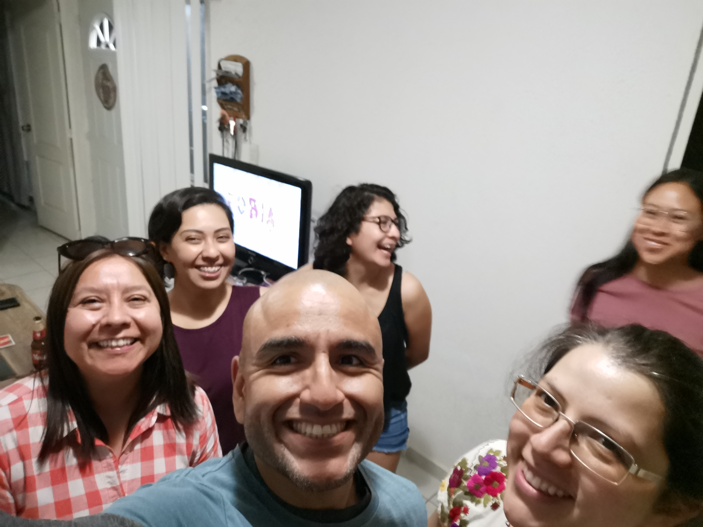

# Ciencia para todas

Antes de regresar a México, Humberto me pidio de favor si podía llevarles unos regalos a unas amigas y a su novia, y de paso, traerle una cámara de regreso. Pensaba ir a Irapuato de cualquier modo, así que aproveché un fin de semana para visitar a gente que quiero y admiro. Sin proponermelo se armó solito un escenario ideal para la misión que me puse antes de regresar a México: "Volver a conocer el pais, verlo con ojos frescos y verlo a través de los ojos de alguien más". Ese fin de semana estaba rodeado de científicas que con origenes, edades y metas distintas, tenían cada una un enfoque particular de la ciencia. Sus nombres serán omitidos por respeto, por seguridad y porque esta historia es posiblemente la más amarga de todas.

- A: Una mujer de la generación X, encargada de administrar las instalaciones de cómputo para darle servicio a todo el instituto.
- K: Mujer millennial, recién graduada del doctorado prestando servicio de cómputo a clientes de varios lados a través del instituto
- L: Mujer millennial, recien doctorada, continuando como postdoctorante en el instituto
- S: Mujer millennial, recien doctorada, navegando en las aguas de la ciencia con una mezcla rara de orgullo y privilegio.
- M: Mujer gen-z, estudiando su maestría, idealista, en mi opinión algo mimada, pero en general buena persona

Como dije, es una historia bastante amarga.

Un año antes de que comenzaran los encierros por la pandemia, en México se cocinaba una olla de presión con las protestas de las morras que marchaban en distintas ciudades exigiendo justicia ante la falta de acción por parte de las autoridades que erán más que incompetentes para esclarecer casos de acoso y abuso sexual, violencia de género y lamentablemente feminicidios. Las instituciones educativas no eran ajenas a la violencia de género que se vive en México, de igual manera las morras se manifestaban con denuncias públicas en donde evidenciaban como muchos de los investigadores eran acosadores cuando menos, violadores cuando más. La pandemia le cayó como anillo al dedo a México, ya que las movilizaciones, las denuncias cesaron, y le dieron un respiro a los acosadores que impunemente pueden operar en México.

Una investigadora del Laboratorio Internacional de Investigación del Genoma Humano (LIIGH para los cuates), interpuso una demanda legal contra Jean Phillipe Vielle Calzada (JPVC, investigador de LANGEBIO-CINVESTAV) por abuso sexual. Ante la evidente falta de resolución por parte de las autoridades, la investigadora, junto con otras víctimas, decidieron recurrir a una instancia si bien menos efectiva, más visible. Decidieron publicar sus testimonios en una revista científica de muy alto impacto y renombre. El caso es por demás complejo, y sencillo a la vez. Es sencillo porque la acusadora ha presentado pruebas reiteradamente, es complicado porque JPVC ha hecho cuanto ha podido por eludir su aprehensión. Para indignación de propios y extraños, JPVC ha mantenido su posición como investigador en LANGEBIO-CINVESTAV.

La olla de presión que lleva decadas calentandose ha estado cerca de reventar en múltiples ocasiones, en aquella ocasión, en un arranque de iniciativa, JPVC consideró que era una buena idea proponerse como candidato a director general del centro de investigación más avanzado en todo México, ésto por si mismo, da para horas y horas de platica indignante.

Cuando S y yo llegamos a Irapuato, nos fuimos directo al restaurante de mariscos que para A,  K y yo, era sinónimo de buena comida, buena cerveza y buenos momentos. L y M llegarían después.

Anteriormente mencione la falsa dicotomía entre el bien y el mal en la que los mexicanos vivimos, Tipicamente muchos hombres viven bajo el concepto de que el feminismo es antónimo de machismo, nada más lejano de la realidad aunque a diferencia del machismo, no hay una definición unificada del feminismo, simultaneamente hay tantas vertientes del feminismo que es imposible ponerlo en una sola cajita. El machismo es más fácil de entender, parte de la idea de que la mujer es inferior al hombre.

Para un varón heterosexual, navegar en los circulos sociales en 2022 supone llevar una etiqueta invisible pero reconocible ante las mujeres y ante la sociedad: el privilegio patriarcal.

No negaré que he sido formado en un ambiente heteronormativo y patriarcal, así como lo ha sido la mitad de la población de mi edad, pero de a poco he ido quitandome muchas de las caracteristicas de un cavernicola heteronormado, unas yo solito, unas con y por Giovanna, unas con ayuda de Jazmin la psicóloga, y lamentablemente algunas características siguen ahí. Pese a todo la etiqueta invisible sigue ahí y está bien, he hecho las paces con ello. Toda mujer que piense que por ser hombre soy un potencial violador tiene todo el derecho de hacerlo a pesar de que puedo decir con tranquilidad que me considero aliado. Muchos hombres recurren a la frase "No todos los hombres son violadores" y tienen razón, a lo que el movimiento feminista ha dicho "No todos los hombres, pero siempre un hombre", argumento que anula de forma por demás elegante el contraargumento de dichos hombres.

Personalmente creo que lo que nos corresponde es demostrar con acciones y no presumir con palabras, si bien llevo conmigo esa etiqueta invisible, es mi deber realizar todo cuanto pueda para mostrar otra etiqueta, aún más invisible.

Estando en este foro con A, K, L, M y S, en donde era portador de la etiqueta de aliado, mi elección lógica era escuchar todo lo que ellas tenían que decir, y vaya que fue una montaña rusa de emociones.

Al principio platicamos de cuanta trivialidad nos viniera a la mente, el clima, la comida, la economia, pero no podíamos ignorar el elefante en la habitación: La situación en CINVESTAV empeoraba en varios aspectos día con día y siendo el centro de investigación más importante de México, sirve como un buen reflejo de lo que ocurre en las demás instituciones educativas.

Un dicho popular mexicano con respecto del amor y la pobreza, dice que "Cuando el dinero sale por la puerta, el amor sale por la ventana", ironicamente es sumamente aplicable a lo que ocurre en cualquier organización, y el CINVESTAV no era la excepción. Al tener cada vez menos presupuesto, los espacios y las condiciones de trabajo son cada vez más tensos y se puede incluso perder la sororidad entre alumnas y entre investigadoras.

Somos productos de nuestro ambiente, y el ambiente inseguro que se vive en México moldea a hombres y mujeres por igual, haciendo que ninguno tome las mejores decisiones.

Para beneficio de muchas personas, incluidos los delincuentes, mexico cuenta con áreas naturales muy extensas, algunas de ellas poco exploradas, algunas otras totalmente desconocidas. La labor de los geólogos y topografos consiste en explorar dichas áreas para obtener información acerca de su composición y potencial de explotación. Lo anterior no es mutuamente excluyente con que el crimen organizado, tan organizado como és, use dichas áreas inexploradas para operar bajo el cobijo que provee la invisibilidad de las áreas remotas. Lo anterior complica mucho las prácticas de los geólogos y topógrafos, ya que una zona que normalmente puede ser usada para preparar a los estudiantes, mañana podría estar asediada por el crimen organizado. MM y Antonio alguna vez estuvieron en un escenario similar al que acabamos de describir. Al momento de llegar al sitio de exploración, hubo algunos voluntarios para revisar los alrededores. Antonio se ofreció, MM hizo lo propio. Antonio le comentó que quizá no era una buena idea, a lo que MM le respondió enojada que ella también merecía una oportunidad de explorar en campo, de no quedarse en el sitio base y de hacer trabajo pesado. Su razonamiento era (acertadamente) que para romper barreras y estereotipos, y también para brindar oportunidades equitativas, las mujeres deberían poder participar en todas las actividades que tradicionalmente le tocan a los hombres.

Antonio le respondio (acertadamente, creo), que no se trataba de una cuestión académica, o laboral o de género, sino de seguridad. Ese comentario suena condescendiente a todas luces, pero Antonio no es el típico macho alfa, elaboró su respuesta argumentando que si en la cuadrilla de exploración iban puros hombres y se encontraban a alguna pandilla de narcomenudistas o de sicarios, existia el riesgo de violencia física y de que los estudiantes murieran a manos del crimen organizado. Si en el grupo de exploración iban mujeres, el riesgo era mucho mayor y mucho peor, no solamente existía el riesgo de violencia física, sino también de violencia sexual, y tal como apunta la tasa de feminicidios en México, era casi seguro que las mujeres, si no es que la cuadrilla entera resultaran muertos ante el posible encuentro con los agresores.

Si la actitud paternalista (que no lo mismo que patriarcal) de Antonio es correcta o incorrecta, no me toca a mi discutirlo, yo hubiera hecho lo mismo probablemente.

En la plática que teníamos en Irapuato, A nos contó que una investigadora, E, a raíz de las denuncias que tenía JPVC, y del entorno inseguro que representaba tener tantos investigadore varones en la institución, decidió no aceptar mujeres como alumnas de maestría o doctorado, con la intención de no exponerlas al ambiente que se vive en el instituto. E es una investigadora que yo admiro mucho, y cierto es que es una gran tutora, me causó una disonancia cognitiva el saber que en un afan de proteger a las alumnas, E les estaba negando una oportunidad de desarrollarse en la ciencia, de demostrarle al mundo que contra todo y contra todo, se puede hacer ciencia en México, más aún siendo mujer.

Si la actitud protectora (que no lo mismo que condescendiente) de E es correcta o incorrecta, no me toca a mi discutirlo, yo no sé que hubiera hecho, pero siento que si aceptaría a las morras como estudiantes.

La narrativa anterior tiene una finalidad y espero hayan caido en la trampa que les acabo de poner, de forma burda quizá.

Tanto la historia de E, como la historia de MM y Antonio, nos concentramos en lo que las víctimas y su red de apoyo hacen para estar relativamente seguros, en vez de prestar atención a lo que realmente ocurre: los violadores, los acosadores y el crimen organizado deberían ser los principales antagonistas de la narrativa, no E, ni Antonio. En defensa del lector, reiteraré que somos producto de nuestro entorno, y nuestro entorno nos ha enseñado a normalizar lo que se vive día a día, el vato que muere tras un asalto fallido, la mujer que fue violada y asesinada, el morrito que fue raptado para pedir un secuestro, las morritas que venden en regiones rurales del país... todos ellos son números, gente sin rostro, personas sin voz, que suman día a día una cuenta que el gobierno, lejos de resolver, se encarga unicamente de barrerla por debajo de la alfombra.

Personalmente creo que hay una razón poderosa por la que que JPVC no ha sido aprehendido y procesado como debería: Alguién alzó la voz en contra de JPVC, y él sabe que está en el reflector, pero está tranquilo porque si él cae, caerán con él otros tantos (hombres y mujeres por igual) que han cometido actos iguales o peores, y se sabe protegido por todo ese mugrero que opera en CINVESTAV (hombres y mujeres por igual). Qué tanto sabrá JPVC de los directivos? Sólo él, dios y los directivos lo saben.

Cómo dije anteriormente, el CINVESTAV es un buen proxy de lo que ocurre en todas las instituciones del pais, por lo que no es de sorprender que esto mismo ocurra en la UNAM, en el IPN, en la UAM, y hasta en universidades patito. Mientras haya silencio, tanto en este como en otros casos, no alcanzaremos una meta más que es tan importante como lejana para el pais: Ciencia para todas.

La cereza en el pastel a toda esta historia que es por demás amarga, es que durante la plática, dos de las científicas presentes no les parecía tan mala idea que JPVC fuera director general del CINVESTAV. Respetando la anonimidad de las científicas, no mencionaré quien dijo qué, pero si me pareció interesante cuando menos, impactante cuando más, escuchar la voz de una mujer apoyando a un violador. Personalmente no creo que se trate de falta de sororidad, ya tu juzgarás si si o si no, lo que si creo es que se trata de un caso extremo de separar al autor de su obra.

Personalmente encuentro repugnante la idea de tener a JPVC como director, para bien y para mal yo no estoy en dicha institución, y lo que puedo hacer es apoyar la ciencia en México desde mi trinchera... pero cada vez cuesta más trabajo darle apoyo a un pais que pareciera se está autodestruyendo... una víctima a la vez, un violador a la vez.

