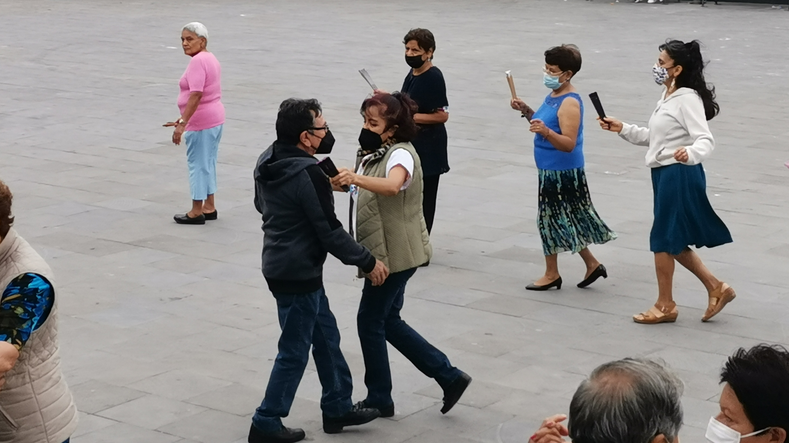

# Dancing club

Victor Flores nació en Hidalgo el 28 de Julio de 1956 en una familia pobre en donde todxs lxs integrantes de la familia hacían de todo. Siempre fue la oveja negra de la familia, pero no por ello dejó de ser una buena persona.

En 1962 su familia dejó el estado de Hidalgo para asentarse en Ecatepec en el Estado de México. Don Herón, el jefe de familia, siempre trabajador y con mucho carisma pese a su carácter violento, fue una figura importante en el barrio de Santa Clara. Los tíos y el abuelo construyeron muchas cosas: escuelas, casas, carreteras, al grado que Santa Clara era de ellos, como ellos eran de Santa Clara a pesar de haber venido de otro estado.

Irma López nació en el estado de México el 10 de Noviembre de 1959. Igualmente de una familia pobre en donde todxs lxs integrantes hacían de todo. Ella era la hermana mayor y desde muy pequeña tuvo que madurar y convertirse en el pilar no oficial de su familia. Don Rogelio se encargó de que la infancia de las niñas fuera compleja, por un lado les dio amor en forma de apego emocional, pero simultaneamente les negó una figura paterna al estar mucho tiempo ausente. "El dango" le llamaban, sabrá dios por qué, y sus hijas en consecuencia eran "Las dangas". Pese a pertenecer a una familia relativamente conservadora, Irma podía escabullirsele a su papá, y doña Julia la alcahueteaba no sin antes decirle "Andate en la lumbre pero no te vayas a quemar". Victor por su parte, siempre podía escabullirse de su casa, pese a los regaños y violencia que suponían dichas escabullidas.

Irma y Victor se conocieron en 1975 en una fiesta de XV años. El baile siempre fue parte de su historia y por mucho tiempo fueron sólo eso: amigos de baile

En todo ese tiempo, el municipio de Ecatepec era muy diferente a lo que es hoy (2022). Se podía caminar tranquilo por las noches, la violencia no imperaba en las calles y podías salir a bailar sin preocuparte por lo que fuera a pasar, además de que tus padres te dijeran al regresar.

Tras 2 años de noviazgo, Irma y Victor se casaron el 23 de Abril de 1983. Para entonces, Irma tenía un trabajo en la fábrica de termostatos y Victor un trabajo en una fábrica de papeles.

Al ser una pareja joven en los 80s, pese a las carencias asociadas a vivir como clase baja-alta, aún les quedaba un camino largo por recorrer. Cuando comenzaron a tener hijos en 1984, Irma dejó su trabajo y Victor se convirtió en el proveedor principal, pero hiperactivos como siempre fueron, ninguno de los dos dejaron de buscar cosas mejores, y para ello tuvieron que trabajarle durisimo. Por mucho tiempo en los 80s y 90s vendieron zapatos, ropa, electrodomésticos y hasta elotes, pese a que Victor tenía un buen puesto en la química Hoechst (ahora Clariant).

En 2001, despidieron a Victor de la fábrica, sólo un par de semanas después de que el mismo renunciara a una posición sindical. Si bien la familia Flores López no bajaba fácil la cabeza, era un momento importante en sus vidas. Por un lado se acababa temporalmente el ingreso principal, por otro lado se podía tomar un descanso después de trabajar durísimo por tantos años, por otro lado, el tiempo no perdonaba, Victor, con 45 años, sin educación formal con un papelito que dijera "Técnico en pa' ni madres", y en medio de una economía frágil... iba a ser imposible conseguir un trabajo que pudiera sustentar adecuadamente a la familia.

Irma y Victor decidieron que abrir una tienda era la mejor idea, y con la tienda, también se abrió un capítulo nuevo en sus vidas. Los primeror meses supusieron cambios enormes, no era para menos la felicidad que trajo consigo el primer día que vendieronn 700 pesos. "700 pesos!!!" Decían cada uno de ellos al contar las ganancias, haciendo cuentas mentales de como podría ser el mes suponiendo que se siguiera vendiendo así. Si en ese momento les hubieran dicho que habría navidades que vendieran 10000 pesos de mercancia, seguro hubieran creido que se trataba de una broma o por lo menos lo hubieran encontrado díficil de creer.

Atender una tienda no era tarea fácil, mucho menos cuando las 4 personas que la atendían tenían personalidades tan distintas y a veces hasta incompatibles.

Irma siempre fue el pilar de la familia, y en más de una ocasión su caracter duro fue lo que mantuvo a la familia unida pero a raya. Este comportamiento no era gratuito: entre su infancia, su modo de relacionarse con la gente y el mal ejemplo de Victor yendose a beber con frecuencia en los 90s con "amigos", Irma no creía en la amistad. Le resultaba complicado creer que sus hijos tuvieran relaciones amistosas significativas y ella misma decía que no tenía ni quería tener amigxs.

La evolución del municipio de Ecatepec no ayudaba al desarrollo del caracter de Irma, la colonia de Santa Clara de a poco se fue convirtiendo en un ente violento y asediado por el crimen. El progreso y la población acentuaban el inminente cambio al que el municipio era sometido.

La relación que Victor e Irma tienen con el lugar en el que viven va más allá de apego, o amor/odio; había historias, lágrimas, sudor, alegrías, tristezas, y esperanzas ancladas a una casa que funge como una fortaleza dentro de la jungla que es Santa Clara.

En el verano de 2018, Victor ganó un litigio en contra del Instituto Mexicano del Seguro Social, y finalmente fue hecho acreedor a una pensión que les permitiría dejar atrás los días de la tienda. Al poco tiempo, Irma tambien obtuvo su pensión y eso suponía tomar un merecidísimo descanso.

La tienda es una especie de monstruito que si bien proteje de todo mal y provee bastante bien, también es ese tipo de ente que requiere toda la atención del mundo. En todo este tiempo no había muchas oportunidades para fiestear o para tomar vacaciones o para bailar.

Al no tener la tienda y al ver que virtualmente no tenían más obligaciones, Irma y Victor podían volver a empezar, aunque no sabían bien por donde. Casi por accidente encontraron un grupo de danzón al cual se inscribieron prontamente y se integraron aún más rápidamente. El grupo de danzón no era solamente eso, era un conjunto de personas compartiendo tiempo y espacio, abriendose a un par de extraños que recién conocían.

En toda su vida, este nuevo episodio era quizá el más satidfactorio para Irma y Victor, en el grupo de danzón encontraban un refugio a lo que vivían día a día, las noticias acerca de la pandemia, las vacunas, los crímenes, la economía... todo eso desaparecía al llegar a la pista de baile a ensayar. Encontraron algo que les resultaba estimulante, retador, divertido y que encima de todo, que disfrutaban.

Irma finalmente comprendió el significado de la amistad y comprendió lo que por tanto tiempo sus hijos habían experimentado: conexiones emocionales con gente en quien podían confiar, tolerar, apreciar e incluso querer.

Su nueva familia suponía no solamente un pretexto para seguir bailando, como habían hecho hace más de 40 años y seguirían haciendo mientras tuvieran la voluntad... no, su familia suponía un granito de esperanza de volver a vivir en una colonia que otrora fuera su pista de baile

