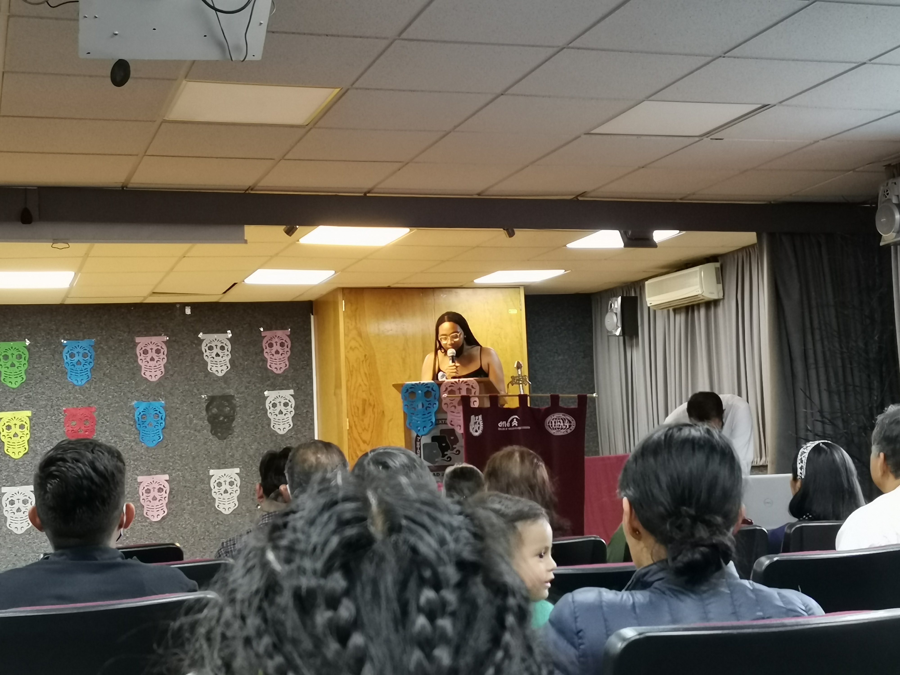

# Nonantzin

Las islas Maldivas son un archipielago en el oceano Índico, tienen cimientos de coral, con una elevación promedio de 1.5 metros sobre el nivel del mar. El cambio climático y el crecimiento del nivel del mar hará que en un periodo relativamente corto, las islas sean inhabitables, y eventualmente sean engullidas por el creciente mar. El pensamiento de la desaparición geográfica de una nación entera es inevitablemente triste. Los demás paises tenemos la opción de no combatir el cambio climático y permanecer ironicamente hundidos en los mares de burocracia de nuestras políticas ambientales. Las Maldivas no tienen opción, o combaten el cambio climático o desaparecen.

Cuando las Maldivas sean inhabitables, el exodo comenzará, y al paso del tiempo la identidad de los maldivos será incorporado en las identidades de las naciones que den asilo a los refugiados.

Al igual que los maldivos, los pueblos indigenas de México sufren constantemente una discriminación que los orilla a establecerse en sus propias comunidades en donde poco a poco adoptan nuevas tecnologías, costumbres y productos, pero sus tradiciones prevalescen a través de los años por comunicación oral y a veces escrita.

Aunque nos cueste aceptarlo, las civilizaciones van y vienen, dejando un legado al margen de la benevolencia de nuestros conquistadores que permiten conservar aquello que consideran digno de conservarse, y en muchos casos porque deshacerse de los artefactos detrás de un legado supone un esfuerzo inutil. Los españoles edificaron sobre ciudades mexicas, porque podían hacerlo, pero derribar los centros ceremoniales de Teotihuacan, Chichén Itzá o Palenque, representaba demasiado esfuerzo, y peor aún, muy poca o nula recompensa.

Es dificil pensar como es que los lenguajes de los pueblos indigenas de México han mostrado resiliencia, y aún en nuestros días, hay centros de aprendizaje de idiomas que cuentan con cursos de nahuatl y de maya.

Siempre admiré las culturas prehispánicas por sus edificaciones, sus jeroglíficos, sus sistemás astronómicos y matemáticos, pero en mi limitado conocimiento, esas culturas eran cosa del pasado. Así como los conquistadores deciden cuales son los fragmentos del legado de una cultura que van a permanecer, también deciden cuales aspectos de una cultura van a ensuciar. Tomando un ejemplo cercano, el pulque era una bebida relativamente popular, pero los productores de cerveza (europeos), divulgaron la idea erronea de que para producir pulque se usaba excremento de tlacuache. Nadie quiere excremento de tlacuache en su bebida, así sea un rumor falso, los ganadores de esta batalla chusca fueron desde luego los productores de cerveza.

Si nos vamos más para atrás, los conquistadores españoles se encargaron de que perpetuaramos la idea de que los habitantes del México prehispánico eran tribus barbáricas, siempre con la duda razonable de que quizá hayan sido tribus barbáricas. La leyenda cuenta que la receta original del pozole incluía carne humana, la cual era obtenida a partir de criminales y prisioneros de guerra, capturados por una de las civilizaciones más aguerridas del México prehispánico: los Mexicas. A menos que podamos viajar en el tiempo, no podemos comprobar si la receta original incluía humano o no.

Actualmente hay cientos de pueblos indigenas en México, y hay una lucha incesante por propios y extraños para mantener las principales características de dichas culturas: sus costumbres y sus lenguajes.

Así como siempre admiré las culturas prehispánicas, también estaba en paz con que dichas culturas fueran cosa del pasado.

> Conserva el lenguaje, conserva la mitología, conserva el folklore, conserva el conocimiento, las costumbres, esas son harina de otro costal.

El conflicto principal que tengo y tendré con la perpetuación de las culturas prehispánicas es que muchas de sus costumbres pueden ser anticuadas cuando menos, y nocivas cuando más.

En la mayoría de las culturas indigenas prevalescen las dinámicas de poder en donde los hombres adultos son los encargados de tomar las decisiones colectivas, mientras que el resto de los miembros de dichos pueblos no pueden sino mirar que su autonomía es inexistente, su voz inaudible y su existencia (que es ya de por sí invisible ante los habitantes de la selva de acero) se vuelve cada vez más invisible.

Sara me invitó (por ponerlo de forma suave) a asistir a una demostración cultural en el Centro de Lenguas Extranjeras del Instituto Politécnico Nacional, en dicha muestra habría comida, poesía, canto, literatura y bailes prehispánicos, presentados por los alumnos del CENLEX. Ibamos en particular por Sabina, una mujer afroamericana con raices polifiléticas, si bien Sabina aún batallaba un poco con el español, ya estaba aprendiendo Nahuatl, y decidio presentar un poema que dice así:

|Madre mía, cuando me muera,          |Nonantzin ihcuac nimiquiz,       |
|-------------------------------------|---------------------------------|
|entiérrame junto a tu hoguera        |motlecuilpan xinechtoca          |
|y cuando vayas a hacer las tortillas,|huan cuac tiaz titlaxcal chihuaz,|
|ahí llora por mí.                    |ompa nopampa xichoca.            |
|Y si alguien te preguntara:          |Huan tla acah mitztlah tlaniz:   |
|-Señora, ¿por qué lloras?            |-Zoapille, ¿tleca tichoca?       |
|Dile que está muy verde la leña      |xiquilhui xoxouhqui in cuahuitl, |
|y te hace llorar con tanto humo.     |techochcti ica popoca.           |

Sin duda un poema hermoso

Al terminar el recital, la demostración gastronómica y la sesión de danza, regresamos al departamento de Sara. Disfruté el evento cultural, pero también tenía presente que en otros lugares del pais, habría individuos hablando el mismo lenguaje, comiendo los mismos platillos, realizando las mismas danzas. Y a la vez, esos mismos individuos serían los que venden mujeres menores de edad, que otorgan a sus hijas en matrimonios arreglados, en donde el padrino de bodas tiene el derecho (si no es que la obligación) de tener sexo no consensuado con las novias que ni bien llegaban a la mayoría de edad. Estos mismos individuos son los que viven en pueblos en donde es perfectamente normal matar al vecino, en venganza porque el vecino mató primero. Estos mismos individuos son los que viven en sitios en donde la policia no opera porque las leyes locales no lo permiten, y en vez, un consejo de ciudadanos (varones adultos) hacen justicia como mejor les parezca.

Las maldivas no tienen opción, eventualmente se legado sería literalmente arrasado por el mar. En México la cosa es distinta, nos esforzamos por mantener vivas nuestras culturas, y está bien, la riqueza que aportan en forma de idiomas, literatura, mitología, folklore, música y comida, es inmesurablemente grande. Pero las identidades culturales son indisolubles, por lo menos a primera inspección, de sus tradiciones, usos y costumbres. De a poco los pueblos indigenas han ido adoptando políticas más equitativas, en Ocotequila las mujeres ya están ejerciendo su derecho al voto, no sin antes ganarse discriminación en su comunidad, así como unas cuantas amenazas de muerte.

No todas las culturas son iguales, y no todas tendrían el mismo destino. Ante el éxodo de los pobladores de las islas Maldivas, la nación corre el riesgo inminente de desaparecer, pero sus huellas genéticas, su literatura y creencias prevalesceran tanto como la integración a nuevas naciones lo permita.

Quizá en México podamos aprender de esto, y quizá podamos aprender a integrar los idiomas de las culturas indigenas, conociendo y difundiendo sus creencias, sin que ello signifique perpetuar esas costumbres que son dañinas para las que no tienen voz, ni voto, ni visibilidad.

Aún a la distancia la leña sigue muy verde, y si me preguntan, pensar en muchas de las cosas que pasan en México si me ha hecho llorar en más de una ocasión.

